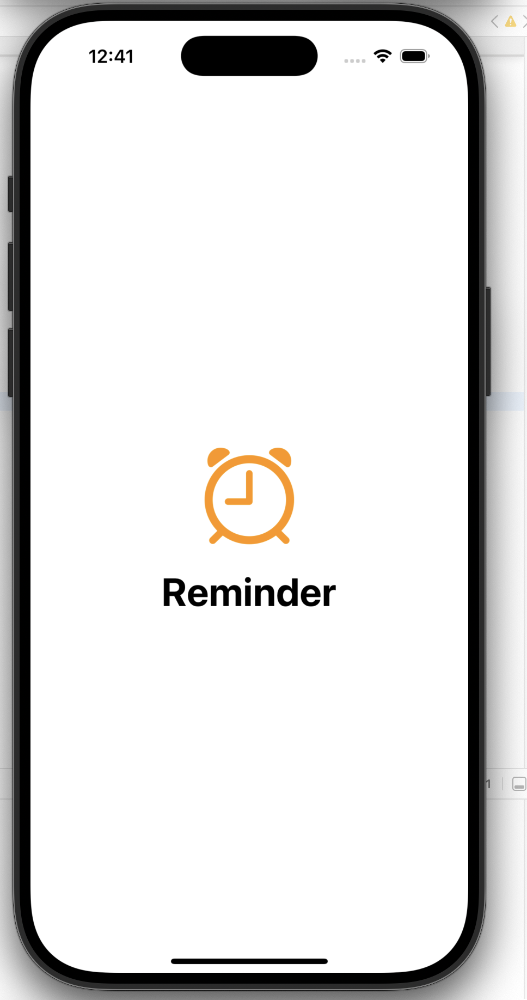
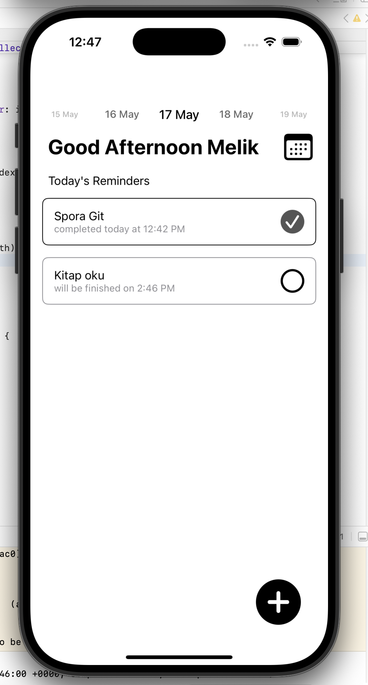

# 📝 Reminder App

Swift ile geliştirilmiş basit ama işlevsel bir Reminder (Hatırlatıcı) uygulamasıdır. Uygulama tamamen **Programmatic UIKit** ile tasarlanmış olup, **Core Data** ve **UserDefaults** ile veri yönetimi sağlamaktadır.
Bu proje, [ICommunity](https://github.com/icommunitycomtr) bootcamp müfredatı çerçevesinde oluşturulmuştur.
## 🚀 Özellikler

- 📌 Hatırlatıcı oluşturma, düzenleme ve silme
- 🧠 Core Data ile kalıcı veri saklama
- ⚙️ UserDefaults ile kullanıcı tercihlerini kaydetme
- 🖼️ Arayüz tamamen programatik olarak UIKit kullanılarak oluşturulmuştur
- 🕶️ Hafif ve modern tasarım

## 🛠 Kullanılan Teknolojiler

- **Swift**
- **UIKit (Programmatic UI)**
- **Core Data** – Kalıcı veri saklama için
- **UserDefaults** – Kullanıcı ayarlarını tutmak için
- **AutoLayout** – Dinamik ekran uyumluluğu

## 📸 Ekran Görüntüleri

| Splash Ekranı | Onboarding | Ana Ekran (Home) |
|---------------|------------|------------------|
|  |  |  |

| Yeni Görev (New Task) | Görev Düzenle (Edit Task) | Görev Silme (Delete Task) |
|------------------------|---------------------------|----------------------------|
|  |  |  |


## 🧩 Kurulum

1. Bu projeyi klonlayın:
   ```bash
   git clone https://github.com/MeliksahSelvi/reminder-swift
